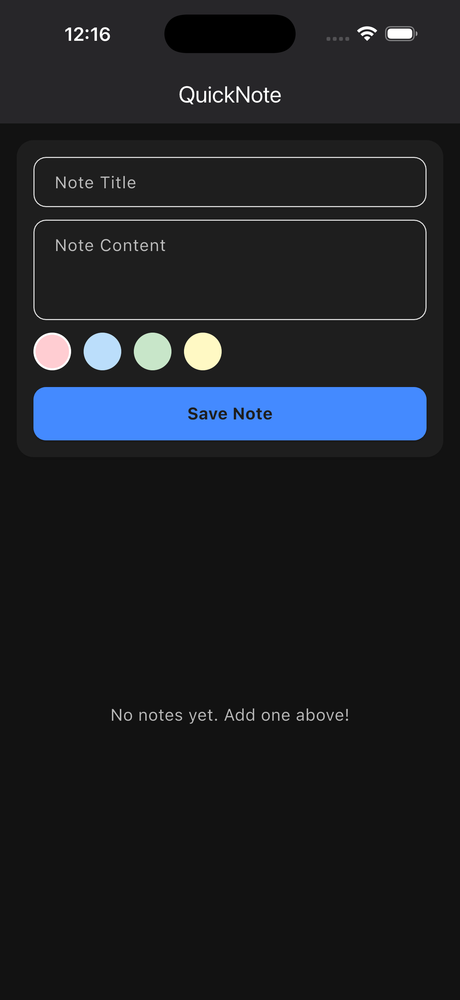
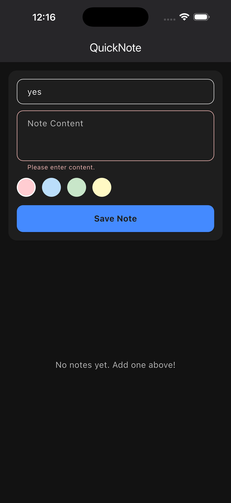
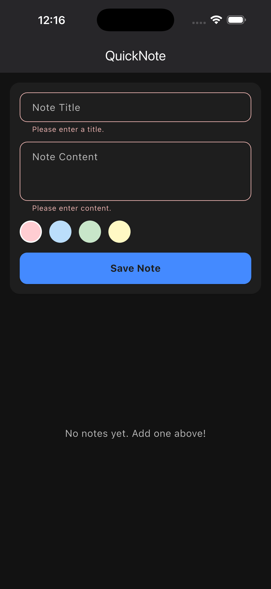
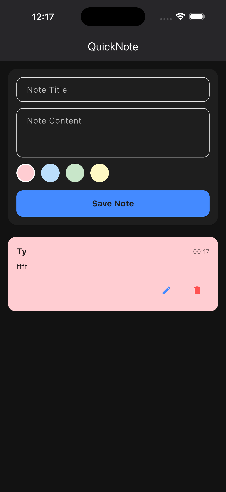
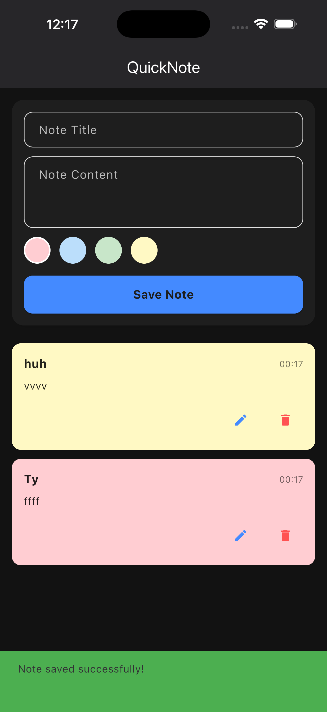
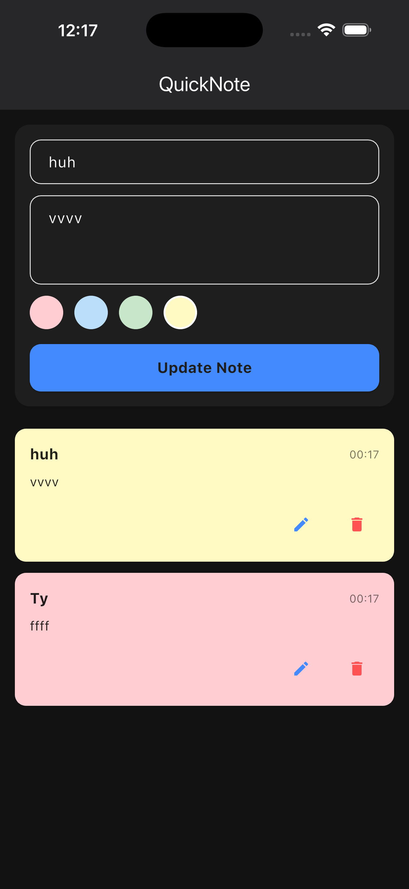
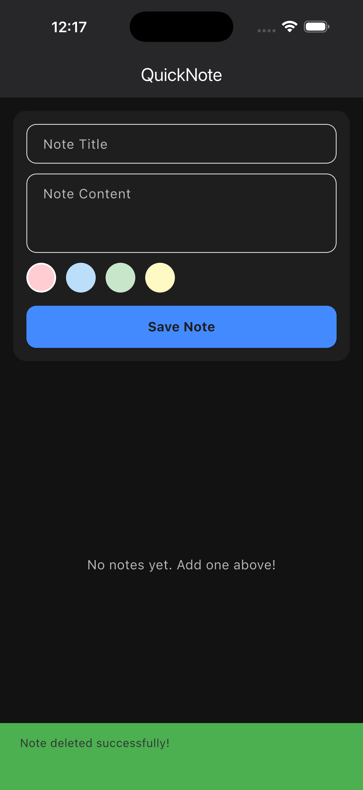
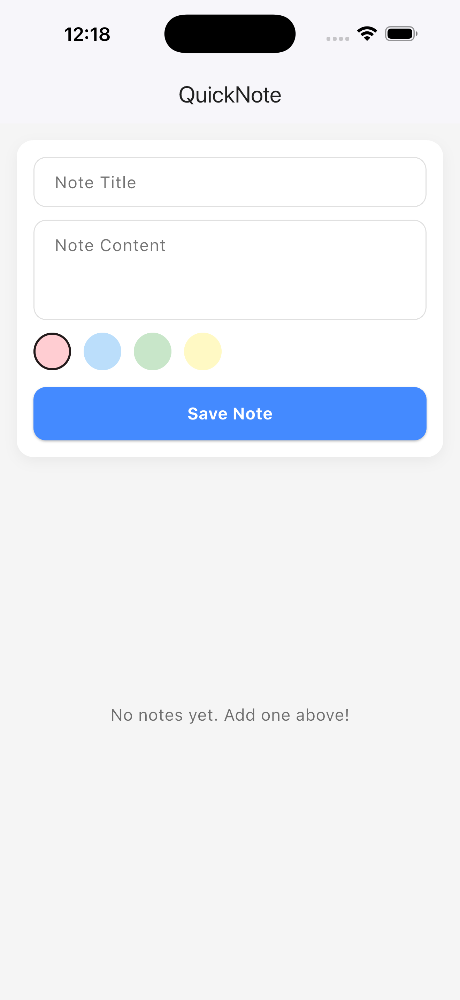

# QuickNote 📝

QuickNote is a beautifully designed, lightweight mobile application for jotting down quick thoughts and categorizing them by color. Built with **Flutter**, it delivers a seamless and highly responsive user experience on both Android and iOS devices.

## 🚀 Features

- **Create & Edit Notes:** Quickly add new notes with a title and multi-line content.
- **Color Coding:** Categorize your notes visually using a built-in color selector (Red, Blue, Green, Yellow).
- **Persistent Storage:** Never lose a thought! Notes are securely saved locally using `shared_preferences`.
- **Sleek UI/UX:** 
  - Dynamic **Dark Mode** support across the entire app.
  - Smooth **AnimatedList** transitions for adding and deleting notes.
  - Inline form validation with clear, localized error states.
- **State Management:** Powered by robust, scalable **Riverpod** state management.

## 📸 Screenshots

| Screenshot 1 | Screenshot 2 | Screenshot 3 | Screenshot 4 |
| --- | --- | --- | --- |
|  |  |  |  |
| **Screenshot 5** | **Screenshot 6** | **Screenshot 7** | **Screenshot 8** |
|  |  |  |  |


## 🛠 Tech Stack & Architecture

- **Framework:** Flutter (Dart)
- **State Management:** Riverpod (`flutter_riverpod`)
- **Storage:** SharedPreferences
- **Design:** Material 3 with extensive custom theming (`AppColors`)

## 📱 Running the App

1. Ensure you have the Flutter SDK installed and an emulator/device connected.
2. Clone this repository and navigate to the project directory.
3. Install dependencies:
   ```bash
   flutter pub get
   ```
4. Run the app:
   ```bash
   flutter run
   ```
